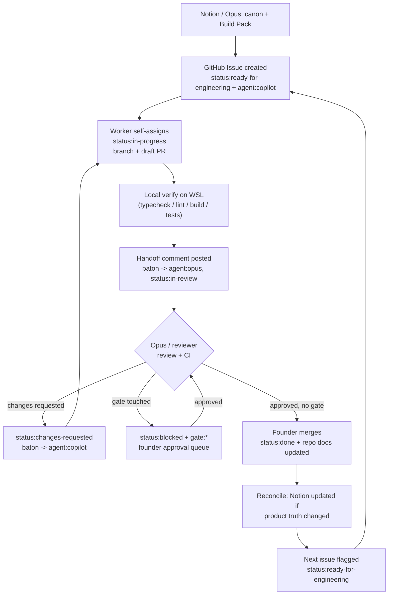

# Closed-Loop Workflow — removing the founder as the message bus

This is the end-to-end loop CLAOS Lite makes durable. Its single design goal: **no step
depends on the founder copy/pasting a message between agents.** Every handoff lands in a
GitHub artifact the next agent can read on its own.

Read alongside [`claos-lite-handoff-relay.md`](./claos-lite-handoff-relay.md) (the why/what),
[`handoff-protocol.md`](./handoff-protocol.md) (the comment mechanics), and
[`label-system.md`](./label-system.md) (the baton).

## The loop

## What makes the loop *closed*

Each arrow is a **durable artifact**, never a chat message:

| Transition | Durable carrier (not chat) |
| --- | --- |
| Notion → work queued | GitHub **issue** with source link + acceptance checklist |
| Worker → reviewer | Draft **PR** + **handoff comment** + label swap |
| Reviewer → worker | **PR review** (`changes-requested`) + label swap |
| Anything → gate | `gate:*` + `status:blocked` + **approval-queue** row |
| Merge → next | `status:done`, updated repo docs, next issue `ready-for-engineering` |

If a transition has no artifact, the baton has not actually moved — fix the artifact, do not
DM the founder.

## The founder's only touchpoints

The founder is deliberately removed from transport and kept only where human judgment is required:

1. **Approval gates** — anything labelled `gate:*` (see [`founder-approval-gates.md`](./founder-approval-gates.md)).
2. **Merge** — pressing merge on an approved PR (until a future, guarded auto-merge rung).
3. **Taste / business calls** — product philosophy, brand, and priorities.

Everything else is agent-to-agent through GitHub.

## Roles in one line each

- **Opus (Notion)** — turns canon into issues/draft PRs; reviews; reconciles Notion after merges.
- **Copilot (VS Code)** — picks up `ready-for-engineering`, implements, verifies locally on WSL, opens/updates the draft PR.
- **Codex / Cursor / Claude** — same relay, additional implementation/review hands when introduced.
- **CI guardrails** — lint, typecheck, tests, drift checks; the automated reviewer that must pass before a human merge.
- **Founder** — gates + merge + taste only.

## Guardrails this loop must never cross

- One agent owns one task on one branch at a time (the **collision rule**).
- No auto-merge, no deploy automation, no arbiter in CLAOS Lite.
- Product canon is protected at every handoff: not a generic job board — Premium Adventure,
  Warm Working Landscape, Operational Efficiency, card-first, mobile-first, zero bloat, the
  **Housing / Meals / Pay** triad, mandatory **Verified Host**, canonical categories
  **farm / maritime / remote / seasonal / mix** (lodge is a *setting* under seasonal, not a
  category), and **Streamline Freehand** icons with **no proprietary assets committed without approval**.
- Build order is respected: Sprint Zero → Design System V1 → Discovery Card V1 → Database V1 → features.
  This relay is foundation work; it does not jump ahead to Discovery Card V1.

## Definition of a healthy loop

- Any agent can open the repo cold and know the exact state from labels + the latest handoff comment.
- No work item is waiting on a message that exists only in someone's chat history.
- Every product-truth change is reflected in Notion **before** the issue is marked `status:done`.
