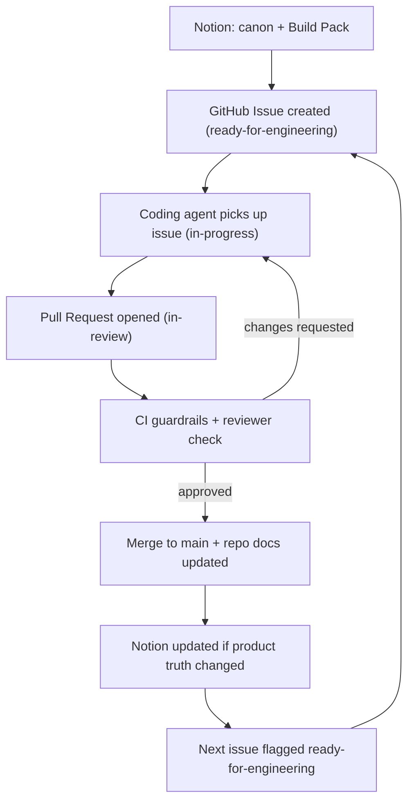

# Cross-Agent Workflow

Think of this project as a **relay race run by specialists**. There is one source of truth (Notion). A specialist agent picks up a clearly-written task, does its part, then **passes the baton** by leaving a durable signal in a shared place. The next agent reacts to that signal. Humans watch the race and step in at marked checkpoints — not on every handoff.

## The four communication channels

1. **Notion pages** — the *why* and *what*: decisions, specs, Build Packs, acceptance criteria.
2. **GitHub Issues** — the *queue*: one issue = one unit of work, with acceptance criteria, labels, and a link back to the Notion source.
3. **GitHub Pull Requests** — the *proposal*: the diff is the conversation.
4. **Status fields & labels** — the *baton*: whose turn it is and what state the work is in.

Never rely on chat memory between agents. Chat is private and disappears; shared artifacts give the system memory and an audit trail.

## The canonical loop

## Status vocabulary (the baton)

`backlog` → `ready-for-engineering` → `in-progress` → `in-review` → `changes-requested` → `done`

- `ready-for-engineering` is set **only** when a task is spec-complete (has a Build Pack or acceptance criteria).
- `in-review` means a PR exists and CI is running.
- `done` means merged + docs updated (+ Notion updated if product truth changed).

## The autonomy ladder (climb it; do not skip it)

| Rung | What's automated | Human stays in the loop |
| --- | --- | --- |
| 0 — Manual relay | Agents do tasks; founder triggers each handoff | Every handoff |
| 1 — Auto-dispatch | `ready-for-engineering` auto-creates issues | Approve issues + all merges |
| 2 — Auto-implement | Agent auto-picks issues, opens PRs | Approve merges + product-truth changes |
| 3 — Auto-merge (guarded) | Low-risk PRs passing CI self-merge | Approval gates on schema/pricing/auth/money/trust |
| 4 — Continuous flow | Agents relay task→task | Founder gates at high-risk decisions + periodic audits |

**Before climbing past rung 2, three things must exist:** CI guardrails, observability, and branch protection on `main`. Without them, "autonomous" just means "unsupervised and drifting."

## The collision rule

A shared IDE makes it easy to accidentally run two engines on the same files — the #1 way multi-agent setups break. **One agent owns one task on one branch at a time.** Parallelism comes later via vertical slices or git worktrees — never by pointing two engines at the same code.
