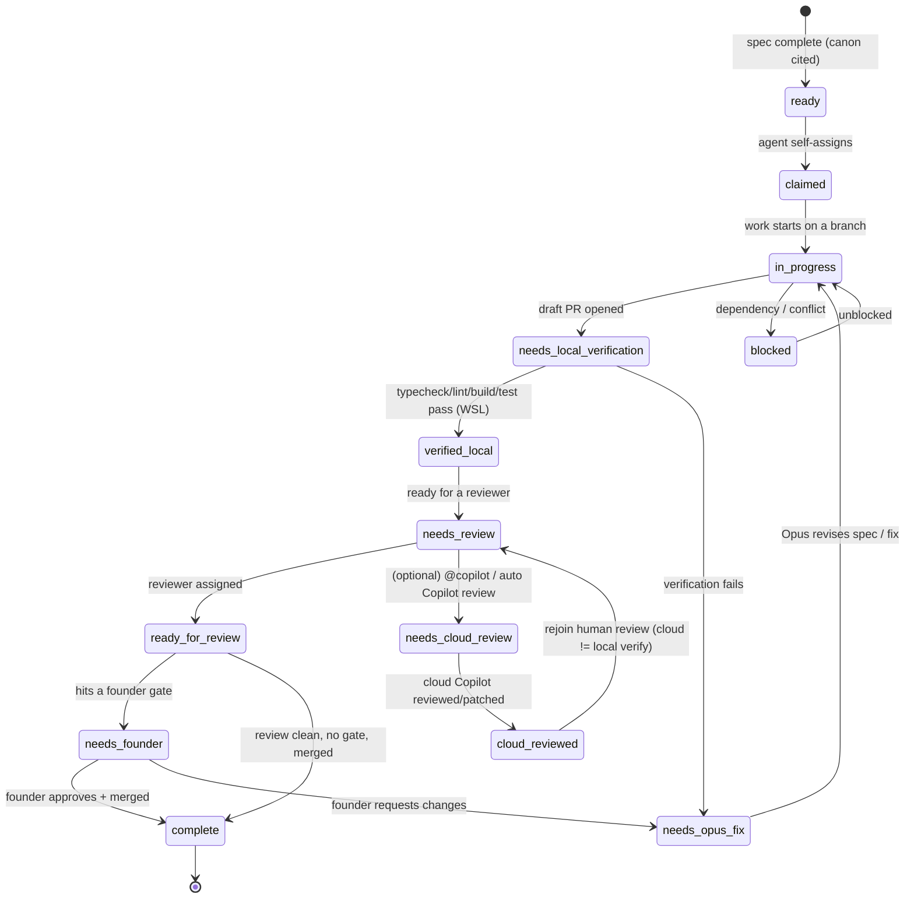

# Relay State Machine

The `status:*` label is the **baton**. Exactly one is set at a time, and it moves along the
edges below. This file is the authoritative transition map plus the protocols for the three
ways the relay can stall: **drift**, **conflict**, and **freeze**. Actor roles and routing live
in [`agent-roster-and-routing.md`](./agent-roster-and-routing.md).

## Status lifecycle

(The diagram uses underscores for Mermaid node names; the real labels use the colon form, e.g. `status:needs-local-verification`.)

### Transition rules

- Exactly one `status:*` and one `agent:*` at all times. Swapping the baton = remove the old label and add the new one in the same action.
- `status:blocked` is the baton state for ordinary work stoppage. `blocked:*` and `freeze:*` labels are additive gates; they do not remove or replace the current `status:*` or `agent:*` labels.
- Every transition is announced with an **Agent Handoff** comment (template in [`github-artifacts-to-apply.md`](./github-artifacts-to-apply.md) §5; role-specific templates in [`handoff-protocol.md`](./handoff-protocol.md)). No silent transitions.
- A draft PR is required from `status:needs-local-verification` onward; it leaves draft only at `status:ready-for-review`.

### Optional cloud review (parallel, advisory)

The GitHub **cloud** Copilot agent (`agent:copilot-cloud`) can review or patch a PR in
parallel with the local path. It is **never** on the critical path to merge.

- **Trigger:** an `@copilot` mention in a PR/issue comment, or GitHub's automatic Copilot PR
  review. The durable internal label for this actor is always `agent:copilot-cloud` (the
  `@copilot` text is only the trigger).
- **States:** `status:needs-cloud-review` → `status:cloud-reviewed`. These live **beside** the
  local pair `status:needs-local-verification` → `status:verified-local`; they do not replace
  it.
- **Hard rule:** `status:cloud-reviewed` is **advisory** and does **not** satisfy
  `status:verified-local`. The cloud agent cannot see or run Jackson's WSL, so a green cloud
  pass is not local verification. An artifact still needs `agent:vscode` to run
  `gh pr checkout` + `pnpm` locally before it can carry `status:verified-local`.
- **Baton hygiene:** while the cloud agent holds the work, `agent:copilot-cloud` is the single
  `agent:*` owner; when it hands back, swap to `agent:vscode` (for local verification) or
  `agent:opus` (for review/fix) per the templates in [`handoff-protocol.md`](./handoff-protocol.md).

## Stall protocol 1 — Drift (`blocked:drift`)

**Definition:** the implementation diverges from Notion canon (wrong behavior, renamed concepts, uncited decisions).

1. Whoever notices applies `blocked:drift`, swaps ownership to `agent:opus`, keeps the current `status:*` in place, and posts a handoff block citing canon vs. the divergence.
2. Opus decides: (a) fix the code to match canon, or (b) if canon itself is wrong, open a `founder-approval-gate` with gate `product-philosophy` to change canon.
3. Resolution removes `blocked:drift`, keeps or advances the same `status:*` according to the normal baton flow, and — if canon changed — requires `canon:cited` on the follow-up PR.

## Stall protocol 2 — Conflict (`blocked:conflict`)

**Definition:** two agents touch the same files/area, or two PRs claim the same task.

1. First-claim wins: the PR/issue that reached `status:claimed` first keeps ownership.
2. The later actor applies `blocked:conflict` to their own work, keeps its current `status:*`, rebases onto the winner, and re-opens as a follow-up.
3. If ownership is genuinely ambiguous, route to `agent:opus` to arbitrate while keeping exactly one `agent:*` label on the blocked artifact — Opus is the orchestrator, not a merge bypass.

## Stall protocol 3 — Freeze (`freeze:all`)

**Definition:** a global hold (incident, canon rewrite, founder call).

1. Only the founder (or Opus on explicit founder instruction) applies `freeze:all`.
2. While present: no merges anywhere, regardless of other labels. Work may continue on branches but existing artifacts keep their current `status:*` + `agent:*`; nothing may advance to `status:complete`.
3. Lifting `freeze:all` is a founder action; agents then resume from their last `status:*`.

## Escalation ladder

worker agent → `agent:opus` (architecture / spec) → `agent:founder` (taste / business / irreversible).

Escalate **upward** only when blocked at your tier. Never skip downward — the founder does not pick up implementation, and Opus does not bypass review or gates.
