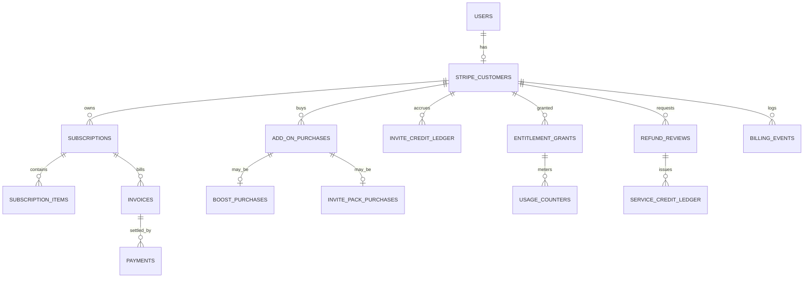

# Billing Data Mirror — Conceptual ERD V1

> **DRAFT.** Conceptual only. **No migrations** are authored here. Column lists are a planning model; authoritative fields live in the Field-Level Billing Dictionary (see Q-BILL-3). All amounts are stored as **integer cents** (G1/G23) — see Q-BILL-1.

## Relationships

## Tables (conceptual columns)

| Table | Key columns | Notes |
| --- | --- | --- |
| `stripe_customers` | id, user_id (unique), stripe_customer_id, livemode, created_at | one per `users.id`; mirror `host_profiles.stripe_customer_id` |
| `subscriptions` | id, customer_id, stripe_subscription_id, plan_tier, interval, status, is_founding, founding_coupon_key, current_period_start/end, cancel_at_period_end | one active per host |
| `subscription_items` | id, subscription_id, price_key, quantity | mirrors Stripe items |
| `invoices` | id, subscription_id, stripe_invoice_id, amount_due_cents, amount_paid_cents, status, period_start/end | cents (G1) |
| `payments` | id, invoice_id, stripe_payment_intent_id, amount_cents, status | cents |
| `entitlements` | key (PK), kind, reset_interval, server_enforced | static definition mirror |
| `entitlement_grants` | id, customer_id, key, source_type, source_id, limit, granted_at, expires_at | source = plan or add-on |
| `usage_counters` | id, customer_id, key, period_start, used, limit | metered usage; reset per interval |
| `invite_credit_ledger` | id, customer_id, delta, reason, related_object_type, related_object_id, created_at | **rolls over; never expires** (Locked Decision) |
| `invite_pack_purchases` | id, add_on_purchase_id, pack_key, quantity, refundable=false | non-refundable |
| `boost_purchases` | id, add_on_purchase_id, listing_id or host_id, surface, starts_at, ends_at | exposure-only (G8) |
| `refund_reviews` | id, customer_id, related_object_type, related_object_id, stripe_charge_id, stripe_refund_id, status, reason_code, outcome_type, reviewed_by | sole refund path (G5) |
| `service_credit_ledger` | id, customer_id, refund_review_id, amount_cents, remaining_cents, applied_to_invoice_id, expires_at | FIFO, 12mo (G29) |
| `billing_events` | id, event_type, actor_id, object_type, object_id, payload, created_at | internal audit mirror |
| `stripe_object_map` | conventional_name, stripe_id, livemode | unique (conventional_name, livemode) |
| `stripe_webhook_events` | event_id (PK), type, processed_at, received_at | idempotency (G17) |
| `dispute_cases` | id, customer_id, stripe_dispute_id, priority, status | from charge.dispute.created |

## Not implemented

No SQL, no Supabase migrations, no RLS policies enacted (see `rls-billing-policy-v1.md` for intent only).
