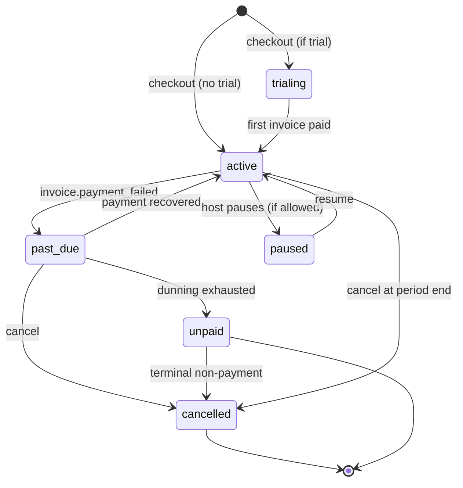

# Subscription Lifecycle & Dunning V1

> **DRAFT.** Models subscription status transitions and failed-payment (dunning) behavior. No logic implemented. Statuses use `BillingStatus` from `packages/contracts/src/billing.ts`.

## Status state machine

## Dunning (on `invoice.payment_failed`)

1. Mark subscription `past_due`; emit `invoice_failed` (analytics) + internal event.
2. Rely on Stripe Smart Retries (config later); do **not** auto-cancel.
3. Notify host (billing notification category).
4. On recovery (`invoice.paid`/`invoice.payment_succeeded`) → back to `active`, re-grant cycle entitlements.
5. On retry exhaustion → `unpaid`, then `cancelled` per policy.

Grace period length and retry schedule are `TODO(?)` (not in canon — founder/Stripe config).

## Entitlement behavior by status

| Status | Entitlements |
| --- | --- |
| `trialing` / `active` | full plan entitlements granted |
| `past_due` | retain entitlements during grace (avoid punishing transient failures) `TODO(?)` confirm |
| `unpaid` | downgrade to free/none; revoke metered grants; **invite credits persist** (roll over, never forfeited) |
| `cancelled` | downgrade to none at period end; founding rate forfeited; **founding seat NOT freed** (G24) |
| `paused` | suspend metered usage; retain account |

Invite credits **never** expire or reset across any status (Locked Decision).

## Founding interactions

- Cancel forfeits the founding rate; the seat is never returned to the pool (G24).
- Tier change swaps the founding coupon (ADR-034); seat integrity preserved.
- Cap-race losers are downgraded to standard price (never cancelled) with a 24h refund-eligibility flag (ADR-035).

## Not implemented

No retry config, no cancellation logic, no notifications wired. Lifecycle modeling only.
