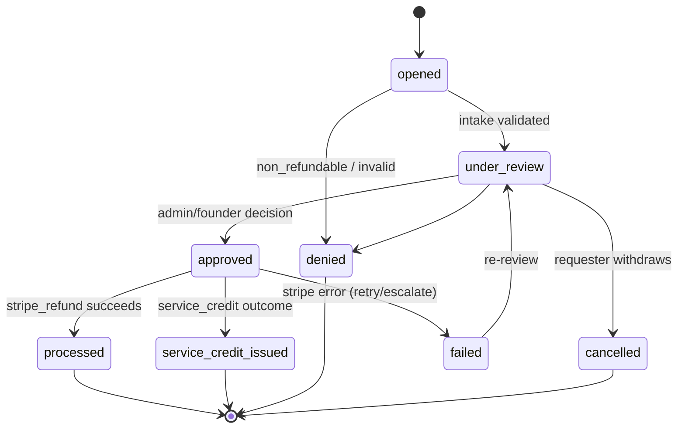

# Refund Review Boundary V1

> **DRAFT.** No auto-refunds. Only the `services/refund-review/` service may call `stripe.refunds.create` (ADR-015, G5). All other code is forbidden from initiating refunds.

## What can be reviewed

| Object | Refundable? | Notes |
| --- | --- | --- |
| Subscription | Yes, per policy | proration handled by Stripe; review gates the decision |
| `addon_additional_listing` | Yes | recurring add-on |
| Boost / Featured / Announcement | Per policy | time-boxed; partial/unused considerations |
| **Invite-credit purchase** | **No** | auto-reject `403 non_refundable_product` |

## State machine

## Reason code → typical outcome

| `RefundReasonCode` | Typical `RefundOutcomeType` | Note |
| --- | --- | --- |
| `duplicate_charge` | `stripe_refund` | clear billing fault |
| `billing_error` | `stripe_refund` | platform/billing fault |
| `platform_error` | `stripe_refund` or `service_credit` | severity-dependent |
| `unused_service` | `service_credit` | goodwill / partial |
| `moderation_action` | `denied` or `service_credit` | case-dependent |
| `goodwill` | `service_credit` | discretionary |
| `fraud_denied` | `denied` | anti-abuse |
| `other` | review-dependent | requires justification |

Mapping is **advisory**; the human reviewer decides. Nothing here auto-selects an outcome.

## Evidence required

| Field | Required |
| --- | --- |
| `stripeChargeId` / invoice ref | Yes |
| `reasonCode` | Yes |
| Requester statement (`evidence`) | Yes |
| Moderation/platform-error context | When applicable |
| `reviewedBy` | On decision |

## Who approves / automation boundary

- Approval is **manual** (admin/founder role) in V1.
- **Automated (allowed):** intake, validation, non-refundable rejection, reconciliation against `charge.refunded`, audit logging.
- **Manual-only:** the approval decision and the `stripe.refunds.create` call.
- Enabling any refund **automation** beyond manual requires founder approval (P-REFUND).

## SLA & queue

Target first-touch and resolution SLAs are `TODO(?)` (not in canon yet). Until set, surface review age in the admin queue and alert on stale reviews.

## Service credit (ADR-033, LOCKED)

- FIFO, oldest-first; auto-applied to next invoice, capped at invoice total; **no cash-out**.
- Expires 12 months (`service_credit_ledger.expires_at`); emit `service_credit.expired` (G29).

## Stripe-side vs app-side

- **Stripe-side:** the refund itself (only via refund-review service).
- **App-side:** review records, audit log (G15), entitlement reversal where applicable, service-credit ledger, reconciliation.

## Not implemented

No refund execution, no Stripe calls, no automation. Manual-review boundary only.
