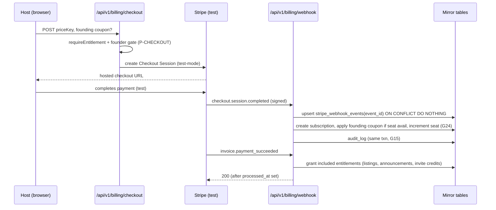
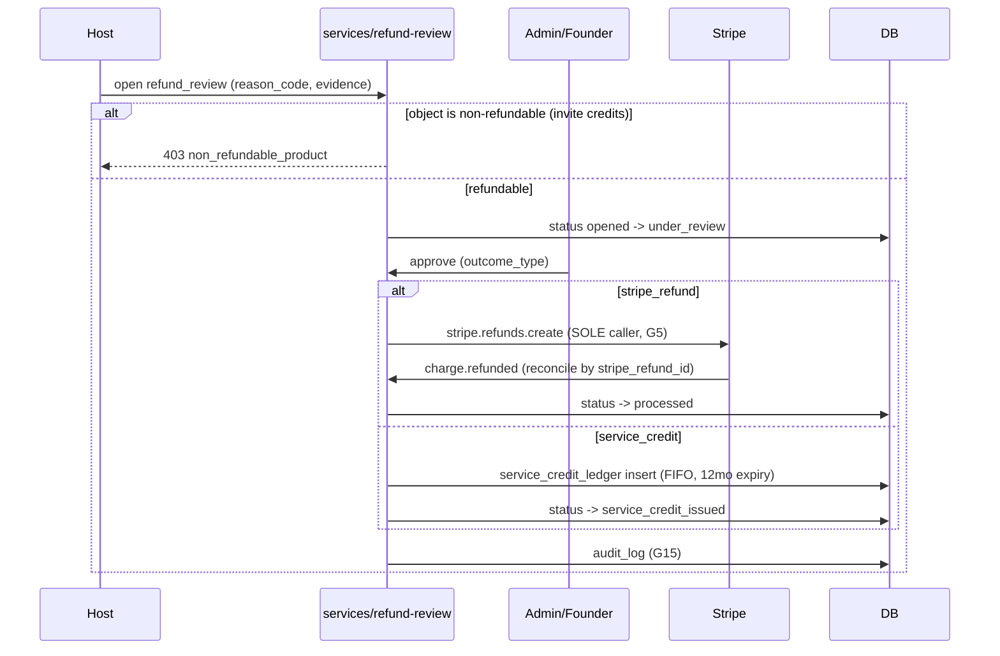

# Billing Sequence Flows V1

> **DRAFT.** Reference flows for the future implementation. No code is implemented here. Routes use the canon namespace `/api/v1/{domain}/{action}`.

## 1. Checkout → subscription activation → entitlement grant



## 2. Founding-seat allocation with cap race (ADR-035)

```mermaid
sequenceDiagram
	participant WH as webhook handler
	participant DB as DB (founding_seats)
	WH->>DB: SELECT count(*) paid founding (server-side cap 100)
	alt seat available
		WH->>DB: apply founding coupon, increment seat
	else cap reached (race lost)
		WH->>DB: downgrade to standard price (NEVER cancel), set refund_eligible_24h flag
		WH->>DB: notify host (billing category)
	end
	Note over WH,DB: Seat is never decremented; cancel forfeits rate but does not free seat (G24)
```

## 3. One-time add-on purchase (boost / featured / invite pack)

```mermaid
sequenceDiagram
	participant H as Host
	participant API as /api/v1/billing/checkout
	participant S as Stripe (test)
	participant WH as /api/v1/billing/webhook
	participant DB as Mirror tables
	H->>API: POST priceKey (addon_*)
	API->>S: invoice item / payment intent (test)
	S->>WH: payment_intent.succeeded
	WH->>DB: insert add_on_purchase
	alt boost / featured
		WH->>DB: create campaign (exposure-only, surface fixed; G8/G21)
	else invite pack
		WH->>DB: invite_credit_ledger += quantity (rolls over)
	end
	WH->>DB: audit_log (G15)
```

## 4. Refund review → service credit (ADR-015 / ADR-033)



## 5. Webhook idempotency (applies to every event)

```mermaid
sequenceDiagram
	participant S as Stripe
	participant WH as webhook
	participant DB as stripe_webhook_events
	S->>WH: event (signed)
	WH->>WH: verify signature (reject if invalid)
	WH->>DB: INSERT event_id ON CONFLICT DO NOTHING
	alt already processed
		WH-->>S: 200 (no-op)
	else new
		WH->>WH: dispatch handler (txn)
		WH->>DB: set processed_at
		WH-->>S: 200
	end
	Note over WH,S: 5xx on failure so Stripe retries; idempotency makes retries safe (G17)
```
