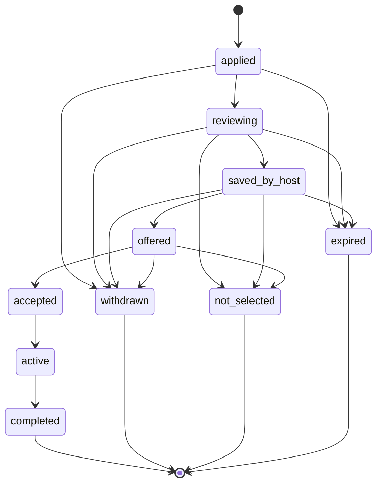

# Application Lifecycle V1

> DRAFT — architecture only. States and transitions are canonical ("Lifecycle Registry", "Canonical Enum Registry", "Application, Invite & Offer State Machines", "Application & Host Review Pipelines"). **Not-selected behavior + re-apply policy LOCKED 2026-05-31** (ADR-0001 §11). Do not invent statuses.

## Canonical states (Enum Registry: `ApplicationStatus`)

`applied`, `reviewing`, `saved_by_host`, `offered`, `accepted`, `active`, `completed`, `not_selected`, `withdrawn`, `expired`.

## State diagram

## Expiry

- **Auto-expire after 30 days** if still in `applied` / `reviewing` / `saved_by_host` (canon; `LIFECYCLE_EXPIRY_DAYS_V1.application_auto_expire`). Auto-expiry is a system lifecycle transition, **not** an automated hiring/rejection decision.

## Not-selected behavior (LOCKED — ADR-0001 §11)

- Neutral and non-shaming: the seeker sees **"Not selected"** with no score and no reason.
- **No free-text reason** is stored in analytics (`application_not_selected` carries IDs only).
- `not_selected` does **not** feed any seeker matching/behavioral penalty — it is a host *fit* decision, firewalled from matching for fairness.
- **Re-apply:** allowed when the listing materially re-opens (new dates/season) **or** after 30 days; capped at **2 applications per (seeker, listing) per 12 months** (`NOT_SELECTED_POLICY_V1`).

## Language rules (canon)

- Do **not** use the term "shortlisted". The canonical host-save state is `saved_by_host`; the analytics event is `candidate_saved` (ADR-0001 §16).
- `viewed` is **metadata** (`viewedAt` / `firstViewedAt` / `lastViewedAt` / `viewedBy`), **not** a lifecycle state.
- Applications (seeker-initiated) and invites (host-initiated) are **separate objects**.

## State visibility separation (Mission Q7)

| Canonical state | Seeker-visible label | Host-visible | Internal/event |
| --- | --- | --- | --- |
| applied | Applied | Applied + viewed metadata | `application_submitted` |
| reviewing | Under review | Reviewing | `application_status_changed` |
| saved_by_host | Saved | Saved (NOT "shortlisted") | `application_status_changed`, `candidate_saved` |
| offered | Offer sent | Offered | offer events |
| accepted | Accepted | Accepted | `application_accepted` |
| active | Active | Active | `application_status_changed` |
| completed | Completed | Completed | `application_completed` |
| not_selected | Not selected | Not selected | `application_not_selected` |
| withdrawn | Withdrawn | Withdrawn | `application_withdrawn` |
| expired | Expired | Expired | `application_expired` |

## Transitions

All transitions MUST be validated against `packages/contracts/lifecycles.ts` via `assert_lifecycle_transition()` (guardrail G16) and use enum values imported from contracts (G13) — no string literals in implementation. The type-level adjacency in `packages/contracts/src/applications.ts` mirrors canon for editor support; `lifecycles.ts` remains the runtime authority.

## Not implemented here

No transition execution, no DB writes, no auto-selection. Type-only `ApplicationState` lives in `packages/contracts/src/applications.ts`.
