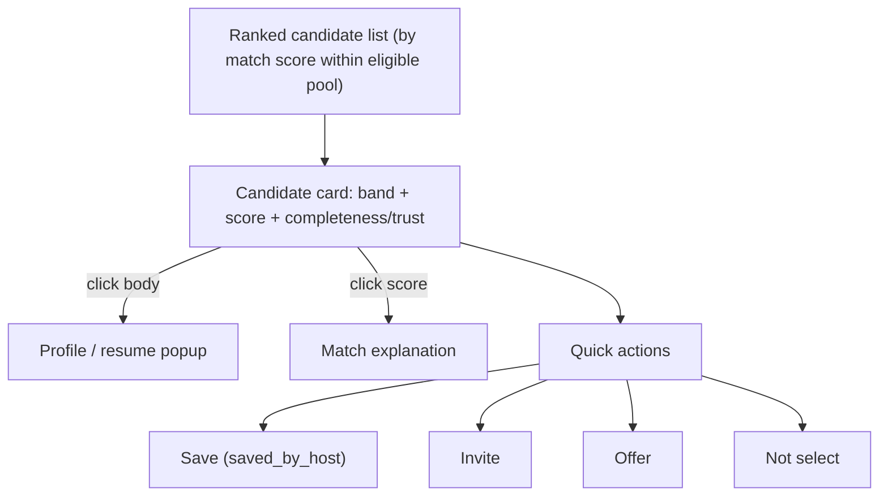

# Host Candidate Review V1

> DRAFT — architecture only, no UI. Canonical from "Application & Host Review Pipelines", "Permission / Visibility / RLS Registry", "Host Dashboard Spec".

Goal: fast, ranked-but-explainable candidate review. Host stays responsible for selection — **no automatic final hiring decisions**.

## Review surface (architecture)

## What the host sees

- Ranked applicant/candidate list (ordered by match score within eligible pool).
- Match band + score, paired with explanation entry point (G11; no score without explanation).
- Profile/resume popup (opened by clicking the candidate card body — `candidate_profile_popup_opened`, proposed event).
- Application status + viewed/saved/invited/offered/accepted/not-selected/expired states.
- Quick actions: save (`saved_by_host`), invite, offer, not select. ("Shortlist" terminology prohibited — use save.)
- Filters by fit/status.
- Trust / profile-completeness signals.
- Notes: **TODO(?)** — whether host notes ship in V1 needs founder confirmation.

## Action → disposition → lifecycle mapping

| Host quick action | Disposition (`HostSeekerDisposition`) | Application effect | Object created |
| --- | --- | --- | --- |
| Save | `saved` | → `saved_by_host` | — |
| Skip | `skipped` | (no state change; metadata) | — |
| Invite | `invited` | — (separate object) | Invite |
| Offer | `offered` | → `offered` | Offer |
| Not select | `not_selected` | → `not_selected` | — |
| (seeker accepts offer) | `accepted` | → `accepted` | — |

## Matched Bucket Context visibility (Permission/Visibility/RLS Registry)

In matched-bucket context the host sees a **limited** seeker card: match score/confidence/reasons, desired categories/roles, **relative** location, availability summary, skills/tags. The host does **not** see full contact, raw resume, or private notes unless there is an application/invite context granting it. Server + RLS enforce; frontend locks are UX-only.

## Host team roles (canon)

`owner`, `admin`, `hiring_manager`, `analyst`, `billing`, `viewer`. Review/decision actions are role-scoped (enforced server-side + RLS). Indicative mapping (confirm against Permission Registry — TODO(?)): decision actions (invite/offer/not-select) require `owner`/`admin`/`hiring_manager`; `analyst`/`viewer` are read-only; `billing` manages credits only.

## Decision velocity, not bloat

Design for rapid review with clear actions. Do **not** build enterprise-ATS bloat. Preserve clean navigation. Decision-velocity affordances (keyboard navigation, single-screen review) are encouraged but UI is out of scope here.

## Not implemented here

No UI, no ranking execution, no decision writes. Architecture only.
