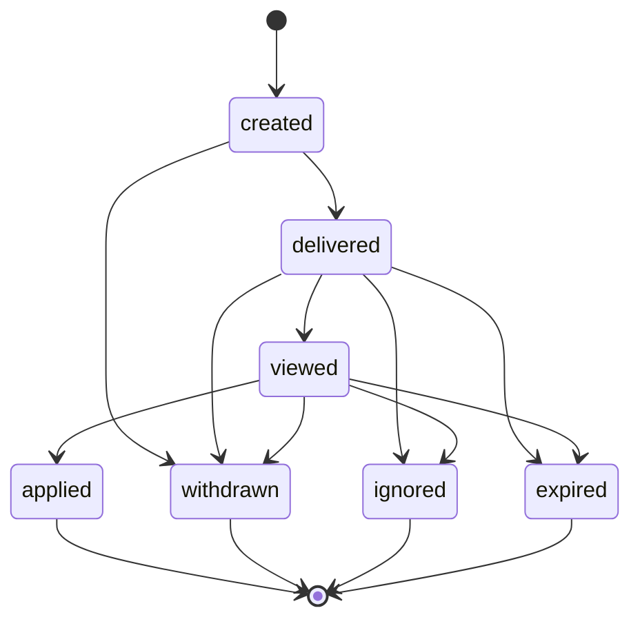

# Invite System V1

> DRAFT — architecture only. Canonical from "Application, Invite & Offer State Machines", "Lifecycle Registry", "Canonical Enum Registry", "Host Dashboard Spec". **Anti-spam caps + reminder policy LOCKED 2026-05-31** (ADR-0001 §8-§9; `INVITE_ANTISPAM_V1`, `REMINDER_SCHEDULE_V1`). Sending is NOT implemented.

Invites are **host-initiated** (host -> seeker for a listing), distinct from seeker-initiated applications.

## Canonical states (Enum Registry: `InviteStatus`)

`created`, `delivered`, `viewed`, `applied`, `ignored`, `expired`, `withdrawn`.

## State diagram

> `applied` links the invite to a seeker-initiated Application object (separate lifecycle).

## Core fields

- sender (host), recipient (seeker), listing/opportunity.
- `match_result_id` + match snapshot recorded at send time (canon).
- expiration, reminders, response state, host-visible status.

## Expiry & reminders (LOCKED)

- **Expires 14 days** after send (canon; `LIFECYCLE_EXPIRY_DAYS_V1.invite_expire`).
- Reminder policy (ADR-0001 §9): `invite_expires_soon` at **T-3 days and T-1 day** before `expiresAt`; max 2 reminders/object; never same-day duplicates; respects G18. **Sending stays deferred** to the Notification build pack — events only here.

## Credits & limits (LOCKED — ADR-0001 §8)

- Sending an invite **consumes an invite credit** (`invite_credit_consumed`). `invite_credit_restored` fires **only** when an invite is withdrawn or expires **before `delivered`** (the seeker never received it); once delivered/viewed, the credit is spent.
- Tier scoping: Starter = 0 included invites (can buy credits), Professional = 5 included, Enterprise = 10 included.
- **Anti-spam caps:**

| Cap | Value |
| --- | --- |
| Active invites per (host, seeker, listing) | 1 |
| Concurrent active invites per (host, seeker) | 2 |
| Invites per (host -> seeker) per rolling 30 days | 3 |
| Per-host daily soft cap (beyond credits) | 50 |
| Per-seeker newly-surfaced invites/day | 10 (overflow digested) |

Rationale: the tightest limits protect the seeker (no duplicate-to-same-listing; max 3 from one host per 30d); relationship-scoped caps keep legitimate high-volume Enterprise hosts unblocked while the 50/day soft cap catches abuse.

## Responsiveness

- Ignored/expired invites feed the cautious responsiveness model (internal-only, capped at 5 pts; see `responsiveness-inactivity-v1.md`). An explicit "not interested" is **not** an ignore.

## Visibility

- Host sees invite status (delivered/viewed/applied/ignored/expired/withdrawn).
- Seeker notification surface: in-app + email per Notification routing canon; sending not implemented (see `notifications-reminders-v1.md`).

## Not implemented here

No sending, no credit mutation, no reminders. Type-only `InviteState` in `packages/contracts/src/invites.ts`; locked caps in `matching-config.ts`.
