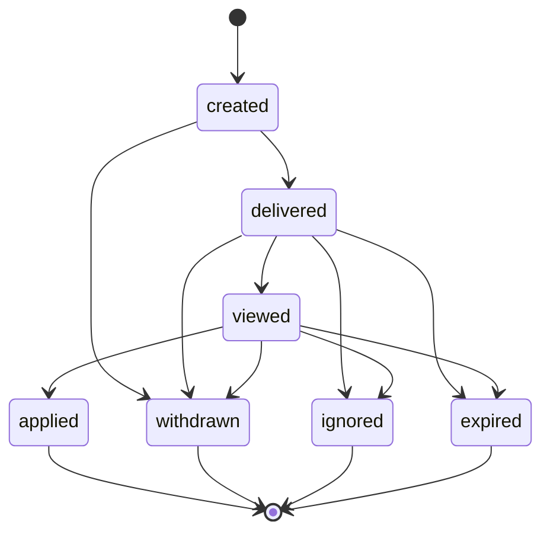

# Invite System V1

> DRAFT — architecture only. Canonical from "Application, Invite & Offer State Machines", "Lifecycle Registry", "Canonical Enum Registry", "Host Dashboard Spec". Sending is NOT implemented.

Invites are **host-initiated** (host → seeker for a listing), distinct from seeker-initiated applications.

## Canonical states (Enum Registry: `InviteStatus`)

`created`, `delivered`, `viewed`, `applied`, `ignored`, `expired`, `withdrawn`.

## State diagram

> `applied` links the invite to a seeker-initiated Application object (separate lifecycle). Adjacency beyond canon is **TODO(?)**.

## Core fields

- sender (host), recipient (seeker), listing/opportunity.
- `match_result_id` + match snapshot recorded at send time (canon).
- expiration, reminders, response state, host-visible status.

## Expiry & reminders

- **Expires 14 days** after send (canon).
- Reminder before expiration: event-only (`invite_expires_soon` notification event); **no sending implemented** here (founder gate: automated reminders). Proposed reminder offsets (TODO(?), founder-gated): T-3 days and T-1 day before `expiresAt`.

## Credits & limits (Host Dashboard Spec)

- Sending an invite **consumes an invite credit** (`invite_credit_consumed`); withdrawn/expired-before-delivery restoration emits `invite_credit_restored` (restore conditions are **TODO(?)**).
- Tier scoping: Starter = 0 included invites (can buy credits), Professional = 5 included, Enterprise = 10 included.
- Anti-spam limits: **TODO(?)** — exact per-host/per-seeker caps need canon/founder.

## Responsiveness

- Ignored/expired invites feed the cautious responsiveness model (internal-only; see `responsiveness-inactivity-v1.md`). Do **not** harshly penalize without canon. Separate "not interested" from "inactive".

## Visibility

- Host sees invite status (delivered/viewed/applied/ignored/expired/withdrawn).
- Seeker notification surface: in-app + email per Notification routing canon; sending not implemented (see `notifications-reminders-v1.md`).

## Not implemented here

No sending, no credit mutation, no reminders. Type-only `InviteState` in `packages/contracts/src/invites.ts`.
