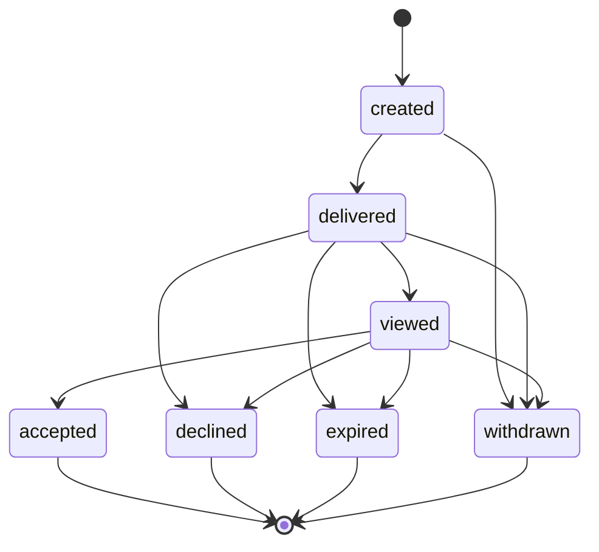

# Offer System V1

> DRAFT — architecture only. Canonical from "Application, Invite & Offer State Machines", "Lifecycle Registry", "Canonical Enum Registry". **Expiry ratified + reminder policy LOCKED 2026-05-31** (ADR-0001 §9-§10). Legal employment-contract logic is NOT created.

## Canonical states (Enum Registry: `OfferStatus`)

`created`, `delivered`, `viewed`, `accepted`, `declined`, `expired`, `withdrawn`.

## State diagram

## Core fields

- sender (host), recipient (seeker), listing.
- terms summary, pay summary, HOUSING/MEALS confirmation (triad — never "perks").
- `extended_at`, expiration, audit trail.

## Expiry & rules (LOCKED)

- **Expires 7 days after `extended_at`** (canon, ratified; `LIFECYCLE_EXPIRY_DAYS_V1.offer_expire`). Rationale (ADR-0001 §10): long enough for a real relocation/housing decision, short enough to keep marketplace velocity.
- Reminder policy: `offer_expires_soon` at **T-3 days and T-1 day** before expiry (ADR-0001 §9). Sending deferred to the Notification build pack.
- Withdraw-before-accept is allowed. Post-accept changes require dispute/admin (not self-serve).

## Legally binding vs informational

- V1 offers are **informational marketplace offers**, not legally binding employment contracts. Any binding/contractual semantics are a **founder + legal approval gate** and out of scope here.

## Audit trail (event mapping)

| Transition | Event |
| --- | --- |
| create | `offer_created` |
| deliver | `offer_delivered` (+ `offer_sent` on send) |
| view | `offer_viewed` |
| accept | `offer_accepted` |
| decline | `offer_declined` |
| expire | `offer_expired` |
| withdraw | `offer_withdrawn` |

All offer transitions emit `offer_*` events (see analytics doc) for an immutable audit history.

## Not implemented here

No sending, no acceptance writes, no contract generation. Type-only `OfferState` in `packages/contracts/src/offers.ts`.
