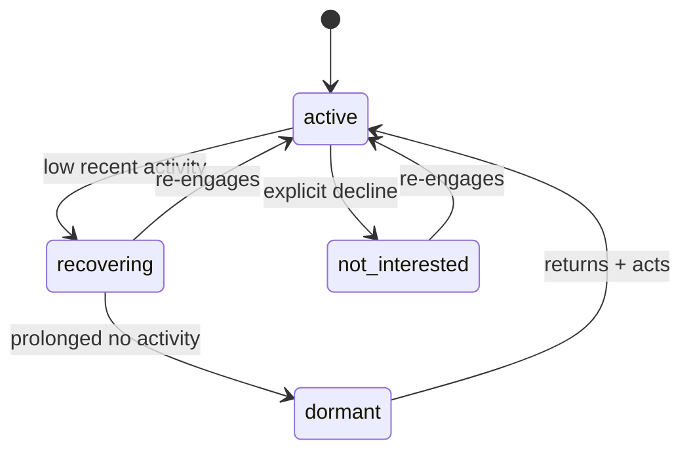

# Responsiveness & Inactivity V1

> DRAFT — architecture only. **Inactivity model LOCKED 2026-05-31** (founder-authorized; ADR-0001 §5). Canonical from "Matching Pipeline", "Matching, Invites & Applicant Review". Encoded as data in `packages/contracts/src/matching-config.ts` (`RESPONSIVENESS_MODEL_V1`).

A **cautious** responsiveness model. Internal-only signals; never public shaming; never hides a candidate.

## Core principle

Responsiveness can move **at most the 5-point behavioral component** (recency max 3 + response-rate max 2). It can never out-weigh genuine fit and can never exclude or hide a candidate.

## Candidate signals (internal-only)

- profile last active / activity recency
- invite / application / offer response rate
- recent ignored invites (an explicit "not interested" decline is NOT an ignore)
- accepted-offer completion history
- notification delivery state

These map to the canonical `behavioral_reliability` weight (5) and confidence recency (10).

## Posture model (LOCKED)

`not_interested` is an explicit, recoverable seeker choice — **separate** from `dormant`/inactivity. Posture is never a black-box suppressor.

## Locked curve (ADR-0001 §5)

- **Cold-start grace:** behavioral component stays neutral until *both* (a) >=14 days since signup *and* (b) >=3 opportunities (invites/applications/offers) presented.
- **Activity recency (max 3 pts):** <=7d -> 3.0; 8-21d -> 2.0; 22-45d -> 1.0; >45d -> **0.5 floor** (never 0; never excludes).
- **Response rate (max 2 pts):** only after >=5 surfaced opportunities in a rolling 90-day window. Ignore-rate -> points: <=20% -> 2.0; 21-50% -> 1.0; >50% -> 0.5. Below sample size -> neutral 2.0.
- **Recovery:** any qualifying activity resets recency immediately; response-rate ages out over the rolling 90 days.

## Rules (canon, preserved)

- Do **not** over-penalize early users (cold-start protection — satisfied by the grace window).
- Explain to a seeker if their profile appears inactive; provide a recovery path. Framing is always "stay active to improve your visibility," never "you were penalized."
- **Separate "not interested" from "inactive"** — a deliberate decline is not inactivity.
- Avoid black-box suppression — any visibility effect is explainable and capped at 5 points.
- Host-facing transparency is an **aggregate label only** ("Active this week" / "Active recently" / "Last active 3+ weeks ago"), never a raw penalty score.

## Not implemented here

No scoring, no suppression logic, no ranking effect. Type-only `ResponsivenessSignal` / `ResponsivenessPosture` in `packages/contracts/src/responsiveness.ts`; locked numbers in `matching-config.ts`.
