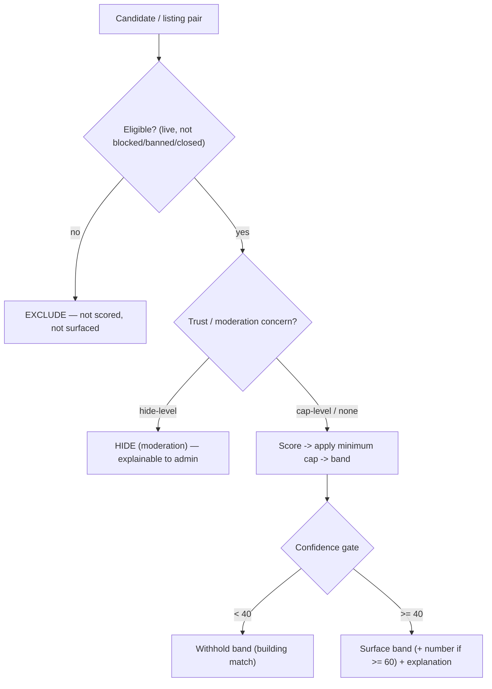

# Match Edge Cases & Determinism V1

> DRAFT — architecture only. Extends [`match-score-model-v1.md`](./match-score-model-v1.md) and ADR-0001 (§17). Specifies deterministic behavior at boundaries and under incomplete data. No scoring engine is implemented here; this defines the **rules the future engine (A-MATCH-DEPLOY) must obey**, verified by [`../security/matching-guardrail-tests-v1.md`](../security/matching-guardrail-tests-v1.md). Config encoded in `packages/contracts/src/matching-config.ts`.

## Why this doc exists

A relevance score is only trustworthy if it behaves **predictably and explainably** at the edges: ties, stacked caps, rounding boundaries, and missing data. Underspecified edges are exactly where opaque or unfair behavior creeps in. Every rule here honors the directive's non-negotiables: explainability, no false precision, no hidden disqualifiers, no protected/sensitive inference, and host & seeker agency.

## Governing principles

1. **Determinism over cleverness** — identical inputs always produce identical output and identical ordering. No randomness, no time-of-day drift beyond declared staleness.
2. **Absence is not failure** — missing data lowers *confidence*, never *score*, and never caps.
3. **A ceiling is a ceiling** — caps bound the score; they never stack additively.
4. **The number can never lie about the band** — display is clamped so it cannot contradict meaning.
5. **Tie-breaks are fit-first, then fairness-neutral** — never engagement-first, never a protected attribute.

## 1. Rounding, display & band consistency

Config: `MATCH_SCORE_ROUNDING_V1`.

- Engine computes in **float**; users never see decimals.
- Display integer = half-up round of the float, shown **only at confidence >= 60**.
- **Band is derived from the internal float**, not from the display integer.
- The display integer is **clamped into its band's numeric range** so it can never contradict the band.

| Internal score | Band (from float) | Naive round | Shown number | Why |
| --- | --- | --- | --- | --- |
| 74.6 | developing (50-74) | 75 | **74** | clamp to band max so "Developing 75" is impossible |
| 75.0 | strong (75-100) | 75 | 75 | exact boundary belongs to strong (inclusive lower bound) |
| 49.5 | needs_attention | 50 | **49** | clamp to band max 49 |
| 88.4 | strong | 88 | 88 | no conflict |

Rationale: a host seeing "75" next to "Developing" would distrust the whole system. Clamping costs at most one display point and fully removes the contradiction. Bands use **inclusive lower bounds** (>=75, >=50) — one canonical owner of each boundary, so no value falls in two bands.

## 2. Stacking hard modifiers

Config: `MATCH_MODIFIER_STACKING_V1`; caps in `MATCH_HARD_MODIFIER_CAPS_V1`.

When more than one cap condition is true, apply the **minimum** cap; never average, never sum.

| Conditions true | Caps | Applied | Concerns emitted |
| --- | --- | --- | --- |
| cert missing (60) + housing not included (65) | {60,65} | **60** | both |
| timeline conflict (50) + visa unavailable (50) | {50,50} | **50** | both |
| none | — | raw score | none |

Each applied cap emits a `MatchConcern`, so the explanation lists **every** reason the score is bounded (no hidden disqualifiers). Caps apply to the **post-weight raw score**; if the raw score is already below a cap, the cap is a no-op but the concern is still surfaced (the condition is real and the host should see it).

## 3. Tie-breaking & determinism

Config: `MATCH_TIEBREAK_ORDER_V1`.

Within a host's pool, candidates with equal scores are ordered by this exact sequence until a difference is found:

1. **score** (desc) — relevance first.
2. **confidence** (desc) — better-evidenced first.
3. **required-skill coverage** (desc) — stronger *gating-reality* fit; true fit, not behavior.
4. **applied_at** (asc) — neutral promptness; first-come. Candidates with no application (e.g. invite targets) sort **after** applicants at this step (null = +infinity).
5. **match_result_version** (desc) — freshest computation wins.
6. **stable id hash** (asc) — deterministic final key (hash of `seekerProfileId`); guarantees a total order with **no randomness**.

Fairness rationale: behavioral/engagement signals are deliberately **not** a primary tie-break (they enter only via fit at step 3, never via activity), so an always-online candidate cannot leapfrog a better-fitting one. The final key is a stable hash, never `Math.random()` and never insertion order, so re-renders and re-computes are identical. **Forbidden tie-breakers:** any protected/sensitive attribute, recency-of-login, tenure, or monetization (G8).

## 4. Missing-data behavior

Config: `MATCH_MISSING_DATA_POLICY_V1`.

| Situation | Score effect | Confidence effect | Surface |
| --- | --- | --- | --- |
| Optional signal absent (e.g. no preferred-skill data) | that sub-weight contributes **0**; no cap | lowered | "Add this to improve your match" |
| Required listing requirement we cannot evaluate (cert field empty on profile) | **no cap** — treated as *unknown*, not *failed* | lowered | "needs info" concern |
| Seeker availability entirely missing | timeline sub-weights contribute 0; no cap | large drop -> often <40 | "Building match" |
| Listing requirements incomplete | evaluate what exists; unknown parts contribute 0 | lowered | host prompted to complete listing |

Key fairness rule: **we never cap or penalize a score purely because data is absent.** Absence routes to confidence (which gates display) plus a completion prompt. This avoids punishing newer or less-complete seekers while still preventing false precision. The missing-cert case here is deliberately *not* the `required_cert_missing` cap — that cap is for a **known-absent** required cert, not an **unknown** one.

## 5. Confidence x cap interaction

- Caps act on **score**; gating acts on **confidence**. They are independent axes.
- A capped-but-high-confidence result (score 50 capped by timeline conflict, confidence 80) **is shown** with its band + concern.
- A high-raw-score but low-confidence result (<40) is **withheld** regardless of score ("Building match").
- Order of operations: raw weighted score -> apply minimum cap -> derive band from capped float -> apply confidence gate to decide what/whether to display.

## 6. Boundary value reference

| Score | Band |
| --- | --- |
| 0 | needs_attention |
| 49 / 49.9 | needs_attention |
| 50 | developing |
| 74 / 74.9 | developing |
| 75 | strong |
| 100 | strong |

| Confidence | Display |
| --- | --- |
| 0-39 | withhold (building match) |
| 40-59 | band + "limited info", no number |
| 60-100 | band + number |

## 7. Empty / sparse pool

Config: `MATCH_EMPTY_POOL_POLICY_V1`.

If a pool yields 0 eligible candidates (or 0 recommendations for a seeker), **never fabricate filler**. Show the honest pool-building prompt and emit `empty_match_bucket_shown` / `match_pool_building_prompt_shown`. Sparse pools render the real results plus a prompt to widen criteria — never padded with low-fit profiles dressed as matches.

## 8. Staleness edge cases

- `now > staleAt` + confidence >= 40 -> show last good band with a "Refreshing" indicator; queue refresh (ADR-0001 §7).
- High-impact input changed (availability/skills/requirements/dates) -> mark stale, queue **immediate** recompute, show "Updating match" rather than a possibly-wrong band.
- A stale result whose listing went non-live -> treated as **exclusion**, not stale display.

## 9. Exclusion vs cap vs hide — decision order

Exclusion (not scored) != cap (scored but bounded) != hide (moderation) != withhold (confidence). These are distinct and each is independently explainable.

## 10. Not-selected & re-apply edges

Config: `NOT_SELECTED_POLICY_V1`.

- Not-selected is **neutral**: no reason stored or shown, no seeker matching penalty.
- Re-apply allowed after **30 days** *or* immediately if the listing **re-opens**; max **2** applications per (seeker, listing) per year.
- A not-selected decision never feeds `behavioral_reliability` (decline != ignore; not-selected != seeker fault).

## 11. Determinism guarantees & non-goals

**Guarantees:** same inputs -> same score, band, display, ordering, and explanation reasons. No randomness anywhere in scoring or tie-breaking.
**Non-goals (V1):** no learned/AI ranking, no per-host personalization of weights, no A/B weight variants. Each is a future founder-gated decision (A-MATCH-DEPLOY) and must not be introduced by the implementing agent.

## Open items

- `TODO(?)` Exact confidence decrement per missing signal — confidence component weights are canon (see score model) but the per-signal decrement curve is owed to founder approval (`Q-MATCH-CONF-CURVE`).
- Canon-sync of §1-§11 determinism rules into Notion (`Q-CANON-SYNC-MATCH`).
