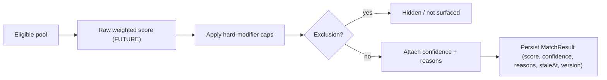

# Match Score Model V1

> DRAFT — architecture only. Canonical values cited from "Exact Ranking, Matching & Boost Formula" and "Matching Pipeline / Scoring / Refresh". Unlocked values marked TODO(?). Final weights are a founder approval gate.

## Purpose

The match score is an **assistive relevance estimate** between a seeker profile and a live listing. It helps seekers find lifestyle-fit opportunities and helps hosts review relevant candidates faster. It is **not** a prediction of job success, a quality ranking of people, or a hiring decision.

## Scale & axes

- `score`: integer **0–100** (canon).
- `confidence`: integer **0–100**, a separate axis describing how much data backs the score (canon). Low confidence must visibly temper the score.
- `band`: a categorical label derived from score. Host-facing display uses the **band**, not raw internal subscores (guardrail G11). Canonical band thresholds and labels are **TODO(?)**; proposed bands `strong` / `developing` / `needs_attention` mirror G11's host-visible categorical labels ("Strong" / "Developing" / "Needs attention"). Exact numeric cutoffs require founder approval.

## Component weights (canon — do NOT alter without ADR + founder gate)

Raw score is composed from (Exact Ranking & Matching Formula). Weights are documented here for reference and are **not** encoded in contracts (founder-gated):

| Component | Weight | Notes |
| --- | --- | --- |
| Timeline / availability fit | 20 | Overlap of seeker availability and listing season/dates |
| Skills / certifications fit | 20 | Structured skills/certs vs listing requirements |
| Role / category fit | 15 | Desired category/role vs listing |
| Housing / meals / pay preference fit | 15 | housing 5 / meals 3 / pay 7 (HOUSING/MEALS/PAY triad) |
| Location / travel fit | 10 | Relative location / travel willingness |
| Seeker goals / open-to fit | 10 | Stated goals and openness |
| Completeness confidence | 5 | Profile/listing completeness contribution |
| Behavioral reliability | 5 | Internal responsiveness/reliability (never public) |

Sum = 100. Per-signal sub-weights beyond those shown are **TODO(?)**.

## Hard modifiers (caps applied AFTER raw score) — canon

Modifiers cap or hide; they never silently delete a candidate without an explainable reason (no hidden disqualifiers).

| Condition | Effect |
| --- | --- |
| Required certification missing | cap score at 60 |
| Impossible timeline conflict | cap at 50 |
| Seeker requires housing but not included | cap at 65 |
| Visa support required but unavailable | cap at 50 |
| Trust / moderation concern | cap or hide |

**Exclusions (not scored at all):** listing not live; seeker blocked/restricted; host/account banned/suspended; listing closed/archived.

## Confidence components (canon)

| Component | Weight |
| --- | --- |
| Seeker resume completion | 25 |
| Listing completion | 25 |
| Relevance extension | 15 |
| Structured skills/certs/tags | 15 |
| Host profile / trust media | 10 |
| Recency / activity | 10 |

## Pipeline shape (architecture only — NOT an implementation)

The boxes marked FUTURE are the founder-gated algorithm; this pack defines their inputs/outputs and boundaries only.

## Worked example (illustrative — NOT a locked output)

> Seeker A vs Listing X: availability overlaps full season (timeline strong), structured farm-equipment certs match requirements (skills strong), housing provided matches need, pay meets minimum. No required cert missing, no timeline conflict. Result: high raw score, high confidence. Surfaced to host as band "Strong" with an explanation listing the four positive signals and one missing item (no references yet). The 30-day-old availability data is within freshness, so no stale flag.

This example demonstrates **explainability and no false precision** — it never claims "97% perfect".

## Display format

- Host-facing: categorical band + score, always paired with an explanation entry point (guardrail: no score display without explanation contract). Example layout (copy not locked — TODO(?)): `Match 82% · Strong fit · Review why`.
- Seeker-facing: optional score or a "why this fits" summary. Exact seeker-visible wording is a **founder approval gate**.
- **No false precision**: never present sub-percent precision or claims like "97% perfect match". The score is heuristic and must be described as such.

## When the score appears / is hidden

- Appears: on relevant cards and in host candidate review when a `MatchResult` exists and the listing is live.
- Hidden: when excluded (see exclusions), when confidence is below a **TODO(?)** display threshold (founder gate), or when a trust/moderation concern triggers hide.

## Storage, staleness, recompute (canon: Matching Pipeline / Scoring / Refresh)

- **Stored**, not computed on read. `MatchResult` core fields: `seekerProfileId`, `listingId`, `score`, `confidence`, `reasons`, `generatedAt`, `staleAt`, `version`.
- Refresh is **hybrid**:

| Trigger class | Examples | Refresh mode |
| --- | --- | --- |
| High-impact change | seeker availability/skills edited, listing requirements/dates changed | immediate recompute |
| Bulk change | new listing enters a pool, batch profile updates | queued bulk recompute |
| Time decay | `now > staleAt` | scheduled stale refresh |

- Stale results (`now > staleAt`) are flagged; display rules for stale-but-shown results are **TODO(?)** (founder gate).
- Candidate pools are built by category / timeline / location / preferences / eligibility / boosted membership (canon). Boosted membership affects pool/placement, never score (G8).

## What the score must NOT claim

- Must not claim to predict hiring success or job performance.
- Must not imply a guarantee or a hiring decision.
- Must not encode or be affected by monetization (G8) or protected/sensitive attributes (see `prohibited-signals-v1.md`).
