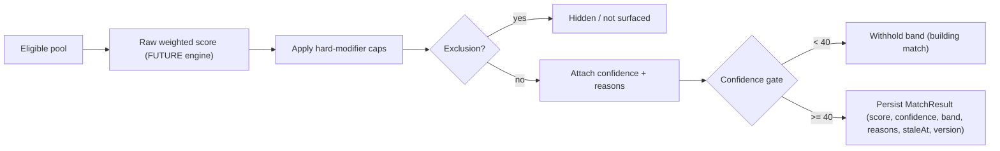

# Match Score Model V1

> DRAFT — architecture only. Canonical values cited from "Exact Ranking, Matching & Boost Formula" and "Matching Pipeline / Scoring / Refresh". **Tuning values are LOCKED 2026-05-31** (founder-authorized) — see [`match-tuning-v1-decisions.md`](./match-tuning-v1-decisions.md) and encoded config in `packages/contracts/src/matching-config.ts`. The scoring **engine** that consumes them is still gated (A-MATCH-DEPLOY) and unbuilt.

## Purpose

The match score is an **assistive relevance estimate** between a seeker profile and a live listing. It helps seekers find lifestyle-fit opportunities and helps hosts review relevant candidates faster. It is **not** a prediction of job success, a quality ranking of people, or a hiring decision.

## Scale & axes

- `score`: integer **0-100** (canon).
- `confidence`: integer **0-100**, a separate axis describing how much data backs the score (canon). Low confidence visibly tempers the score (see display gating).
- `band`: a categorical label derived from score. Host-facing display uses the **band**, not raw internal subscores (guardrail G11).

## Band thresholds (LOCKED — ADR-0001 §6)

| Band | Score range | Host label | Seeker label |
| --- | --- | --- | --- |
| `strong` | 75-100 | Strong | Strong fit |
| `developing` | 50-74 | Developing | Good fit |
| `needs_attention` | 0-49 | Needs attention | Partial fit |

Thresholds + labels are encoded in `matching-config.ts` (`MATCH_BAND_THRESHOLDS_V1`, `BAND_LABELS_V1`). Rationale: reaching 75 requires clearing most of the two gating realities (timeline+skills = 40 pts) plus real secondary fit; below 50 a gating reality is weak or a hard cap applied. Proposed CI check **G33** keeps thresholds ordered.

## Component weights (LOCKED — canon top-level + architect sub-weights, ADR-0001 §1-§2)

Encoded in `matching-config.ts` (`MATCH_COMPONENT_WEIGHTS_V1`, `MATCH_SUBWEIGHTS_V1`). Proposed CI checks **G31** (sum=100) and **G32** (sub-weights sum to parent).

| Component | Weight | Sub-weights |
| --- | --- | --- |
| Timeline / availability | 20 | window overlap 14 / start alignment 4 / shift compat 2 |
| Skills / certifications | 20 | required coverage 12 / preferred 5 / tag overlap 3 |
| Role / category | 15 | primary 11 / adjacent 4 |
| Housing / Meals / Pay | 15 | housing 5 / meals 3 / pay-meets-min 5 / pay-above-margin 2 |
| Location / travel | 10 | region or commute 6 / travel willingness 4 |
| Seeker goals / open-to | 10 | explicit open-to 6 / stated goal 4 |
| Completeness confidence | 5 | completeness 5 |
| Behavioral reliability | 5 | activity recency 3 / response rate 2 |

Sum = 100. The two gating realities (timeline, skills) carry the most weight; completeness + behavioral are deliberately the smallest so platform behavior can never out-rank genuine fit. Full defense in the decisions doc.

## Hard modifiers (caps applied AFTER raw score) — canon, ratified

Modifiers cap or hide; they never silently delete a candidate without an explainable reason (no hidden disqualifiers). Caps are encoded in `MATCH_HARD_MODIFIER_CAPS_V1` and set at band boundaries so the resulting band tells the truth.

| Condition | Effect |
| --- | --- |
| Required certification missing | cap score at 60 (never "Strong") |
| Impossible timeline conflict | cap at 50 |
| Seeker requires housing but not included | cap at 65 |
| Visa support required but unavailable | cap at 50 |
| Trust / moderation concern | cap or hide (moderation service) |

**Exclusions (not scored at all):** listing not live; seeker blocked/restricted; host/account banned/suspended; listing closed/archived.

## Confidence components (canon)

| Component | Weight |
| --- | --- |
| Seeker resume completion | 25 |
| Listing completion | 25 |
| Relevance extension | 15 |
| Structured skills/certs/tags | 15 |
| Host profile / trust media | 10 |
| Recency / activity | 10 |

## Confidence display gating (LOCKED — ADR-0001 §7)

- **confidence < 40** -> withhold score + band; show "Building match - complete your profile" (seeker) / "Limited data" (host).
- **40 <= confidence < 60** -> show band with a "based on limited info" qualifier.
- **confidence >= 60** -> full display (band + rounded score where shown).

Encoded in `MATCH_CONFIDENCE_DISPLAY_V1`. This operationalizes "no false precision."

## Determinism, rounding & edge cases (LOCKED — ADR-0001 §17)

Full specification: [`match-edge-cases-v1.md`](./match-edge-cases-v1.md). Acceptance tests: [`../security/matching-guardrail-tests-v1.md`](../security/matching-guardrail-tests-v1.md). Summary of the locked rules:

- **Rounding** (`MATCH_SCORE_ROUNDING_V1`): the engine works in float; the display is a half-up integer shown only at confidence >= 60. The **band is derived from the internal (unrounded) score**, and the displayed integer is **clamped into the band's range** so a shown number can never contradict its band (an internal 74.6 displays as 74 with a "Developing" band, never a misleading 75).
- **Stacking caps** (`MATCH_MODIFIER_STACKING_V1`): when several hard modifiers apply, the **most restrictive (minimum) cap wins** — caps are ceilings, never averaged or summed. Every applied cap emits a `MatchConcern` (no hidden disqualifiers).
- **Tie-breaking** (`MATCH_TIEBREAK_ORDER_V1`): ties resolve by score -> confidence -> required-skill coverage -> neutral promptness (applied_at) -> result version -> a **stable deterministic id hash**. Never random; never a protected/sensitive attribute; never engagement as a primary key.
- **Missing data** (`MATCH_MISSING_DATA_POLICY_V1`): absence of data **never lowers the score and never triggers a cap** — it lowers **confidence** and surfaces a "needs info" prompt. Candidates are nudged via completion prompts, not punished via score.
- **Empty pool** (`MATCH_EMPTY_POOL_POLICY_V1`): never fabricate matches to fill space; show an honest pool-building prompt.

## Pipeline shape (architecture only — NOT an implementation)

The box marked FUTURE engine is gated by A-MATCH-DEPLOY; this pack defines its inputs/outputs, config, and boundaries only.

## Worked example (illustrative — NOT a locked output)

> Seeker A vs Listing X: availability overlaps full season (timeline ~19/20), structured farm-equipment certs cover required skills (skills ~18/20), housing provided matches need, pay meets minimum (HMP ~13/15), role exact (15), location in-region (8/10), goals aligned (8/10), profile complete (confidence ~78). No required cert missing, no timeline conflict. Raw ~ 88 -> band **Strong** (>=75), confidence 78 -> full display. Surfaced to the host as "Strong" with the four positive signals + one missing item (no references yet). 30-day-old availability is within freshness -> no stale flag.

This demonstrates **explainability and no false precision** — it never claims "97% perfect".

## Display format

- Host-facing: categorical band + score (confidence-gated), always paired with an explanation entry point (no score display without an explanation contract). Example: `Strong - Review why` (numeric score shown only at confidence >= 60).
- Seeker-facing: band label ("Strong fit" / "Good fit" / "Partial fit") + "Why this fits" summary. Locked copy in `BAND_LABELS_V1`.
- **No false precision**: never present sub-percent precision or claims like "97% perfect match".

## When the score appears / is hidden

- Appears: on relevant cards and in host candidate review when a `MatchResult` exists, the listing is live, and confidence >= 40.
- Hidden: when excluded (see exclusions), when confidence < 40 (show "building match"), or when a trust/moderation concern triggers hide.

## Storage, staleness, recompute (canon: Matching Pipeline / Scoring / Refresh)

- **Stored**, not computed on read. `MatchResult` core fields: `seekerProfileId`, `listingId`, `score`, `confidence`, `band`, `reasons`, `generatedAt`, `staleAt`, `version`.
- Refresh is **hybrid**:

| Trigger class | Examples | Refresh mode |
| --- | --- | --- |
| High-impact change | seeker availability/skills edited, listing requirements/dates changed | immediate recompute |
| Bulk change | new listing enters a pool, batch profile updates | queued bulk recompute |
| Time decay | `now > staleAt` | scheduled stale refresh |

- **Stale-but-shown rule (LOCKED — ADR-0001 §7):** if `now > staleAt` and confidence >= 40, show the last good band with a "Refreshing" indicator and queue a refresh; if a high-impact input changed, mark stale, queue an immediate recompute, and show "Updating match" instead of a possibly-wrong band.
- Candidate pools are built by category / timeline / location / preferences / eligibility / boosted membership (canon). Boosted membership affects pool/placement, never score (G8).

## What the score must NOT claim

- Must not claim to predict hiring success or job performance.
- Must not imply a guarantee or a hiring decision.
- Must not encode or be affected by monetization (G8) or protected/sensitive attributes (see `prohibited-signals-v1.md`).
