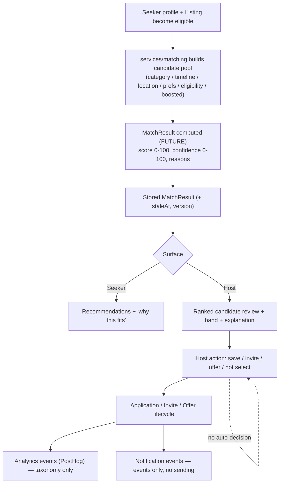

# Matching & Hiring Pipeline V1 — Build Pack

> Status: DRAFT — architecture only. No algorithm, ML/AI scoring, production ranking, external AI API, or automated hiring decision is implemented by this pack.
> Owner: Matching/Hiring architecture. Author: Opus (architect). Verifier: VS Code/Copilot.

This build pack prepares the matching, ranking, recommendation, candidate review, invite, offer, and hiring-decision architecture for future implementation by Codex/Copilot agents. It is **source-of-truth driven**: every value either cites Notion canon or is marked `TODO(?)` and routed to the founder approval queue.

## Source of truth

This pack is derived from (Notion canon):

- Matching Pipeline / Scoring / Refresh
- Exact Ranking, Matching & Boost Formula (component weights, hard modifiers, confidence)
- Application, Invite & Offer State Machines
- Lifecycle Registry (canonical lifecycle states + auto-expiry)
- Canonical Enum Registry (status enums)
- Canonical Event Registry (analytics + notification events)
- Application & Host Review Pipelines
- Permission / Visibility / RLS Registry
- Host Dashboard Spec (tier scoping of invites)
- CI Guardrails Spec (G1–G30; relevant: G8, G11, G13, G16, G18, G20, G28, G30)
- AGENTS.md (HOUSING/MEALS/PAY triad; matching forbidden-until-founder-approved; cite canon; TS strict; one icon system)

Where this pack and the directive disagree with canon, **canon wins** and the disagreement is logged under Open Questions (`../source-of-truth/open-questions.md`).

## What matching means (Mission Q1)

Matching in Explore&Earn is the computation of a **relevance relationship** between a seeker profile and a live listing, expressed as a stored `MatchResult` with a `score` (0–100), a `confidence` (0–100), and human-readable `reasons`. It is a lifestyle-fit relevance estimate — not a hiring decision, not a prediction of success, and not a ranking of human worth.

## What ranking means (Mission Q2)

Ranking is the **ordering of candidates or opportunities for display**, derived primarily from match score within an eligible candidate pool. Ranking is assistive: it orders what a host or seeker reviews. It never selects, rejects, hires, or hides a person without an explainable, documented reason. Monetization (boost/featured) may affect **discovery placement** in `services/discovery`, but per guardrail G8 it must **never** affect match score in `services/matching`.

## Seeker-facing vs host-facing (Mission Q5)

- **Seeker-facing**: recommended opportunities, an optional plain-language "why this fits", HOUSING/MEALS/PAY fit, location/date fit, host verification/trust markers, and prompts to complete profile. Critical requirements are never hidden. See `seeker-recommendations-v1.md`.
- **Host-facing**: ranked applicant/candidate list, categorical match band + score (see G11), match explanation, profile/resume popup, application/invite/offer states, quick actions, fit/status filters, and trust/completeness signals. See `../hiring/host-candidate-review-v1.md`.
- **Internal-only**: raw numeric subscores, behavioral/responsiveness signals, candidate pool internals, staleness bookkeeping.

## Document map

| Doc | Purpose |
| --- | --- |
| `match-score-model-v1.md` | Score purpose, scale, display, confidence, staleness, recompute, storage |
| `match-signal-registry-v1.md` | Every candidate signal + visibility/weight/privacy/fairness/V1 status |
| `match-explanation-v1.md` | Explanation structure and copy rules |
| `match-edge-cases-v1.md` | Determinism: tie-breaking, stacking caps, rounding/boundary, missing-data, empty-pool |
| `match-tuning-v1-decisions.md` | Locked tuning values + full justification (ADR-0001 mirror) |
| `prohibited-signals-v1.md` | Signals that must never be used or inferred |
| `seeker-recommendations-v1.md` | Seeker-side discovery recommendation architecture |
| `../hiring/application-lifecycle-v1.md` | Application states, transitions, expiry (+ diagram) |
| `../hiring/invite-system-v1.md` | Invite architecture, expiry, reminders, credits (+ diagram) |
| `../hiring/offer-system-v1.md` | Offer architecture, expiry, audit, binding scope (+ diagram) |
| `../hiring/host-candidate-review-v1.md` | Host review surface architecture |
| `../hiring/responsiveness-inactivity-v1.md` | Cautious responsiveness model |
| `../hiring/notifications-reminders-v1.md` | Notification/reminder events (events only) |
| `../analytics/matching-hiring-events-v1.md` | PostHog event taxonomy (per-event tables) |
| `../security/matching-fairness-approval-gates.md` | Founder approval gates + proposed guardrails |
| `../security/matching-guardrail-tests-v1.md` | Given/When/Then acceptance tests for G8/G11/G16/G31-G34 |
| `../architecture/matching-service-boundaries.md` | Service roles + import boundaries |

## End-to-end flow (architecture, not implementation)

## Contracts (type-only + locked config)

This pack adds type-only contracts under `packages/contracts/src/`: `matching.ts`, `applications.ts`, `invites.ts`, `offers.ts`, `hiring.ts`, `responsiveness.ts`, `matching-events.ts`, plus locked tuning **config data** in `matching-config.ts` (constants only — no algorithm, no functions, no DB/AI calls). The type files contain **types only**; `matching-config.ts` contains **plain config constants**. Status unions and type-level transition maps mirror the Canonical Enum / Lifecycle Registries verbatim; runtime authority remains `lifecycles.ts` (G16). When `enums.ts`/`lifecycles.ts` are regenerated (Contracts V1), these should import from there. See each file header.

> Note: as of 2026-05-31 (founder-authorized), the locked tuning **values** (weights, sub-weights, caps, band thresholds, inactivity, anti-spam, reminders, determinism rules) live in `matching-config.ts` as **configuration data only** — there is no scoring function. `matching.ts` still exposes only type-level component *keys*; the scoring **engine** that consumes the config remains founder-gated (A-MATCH-DEPLOY). Full justification in `match-tuning-v1-decisions.md` / ADR-0001.

## Future DB/API dependencies (Mission Q13)

Deferred to the Backend / Database V1 and API Contract build packs. Anticipated (not built here): `match_results`, `applications`, `invites`, `offers`, `hiring_events` tables; read APIs for ranked pools and explanations; write APIs for invite/offer/application transitions. All gated; see service READMEs and approval-gates doc.

## What agents must NOT implement yet (Mission Q15)

See `../security/matching-fairness-approval-gates.md`. In short: no scoring algorithm, no ML/AI, no external AI API, no auto-reject/auto-hire, no notification sending, no production ranking, no protected-class fields, no match-score display without an explanation contract.
